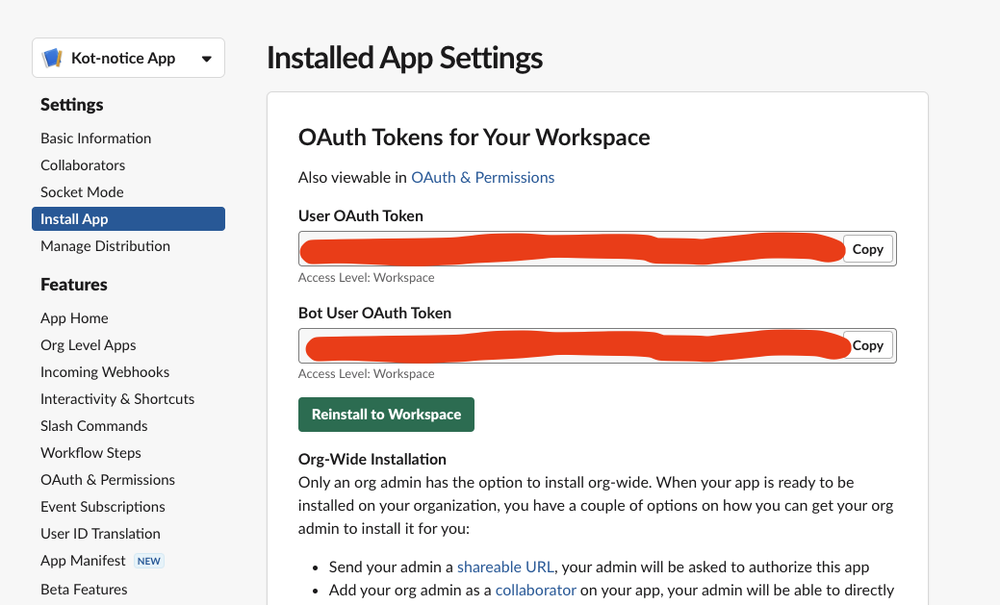
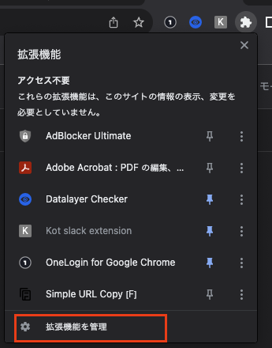
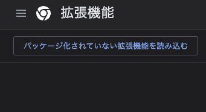
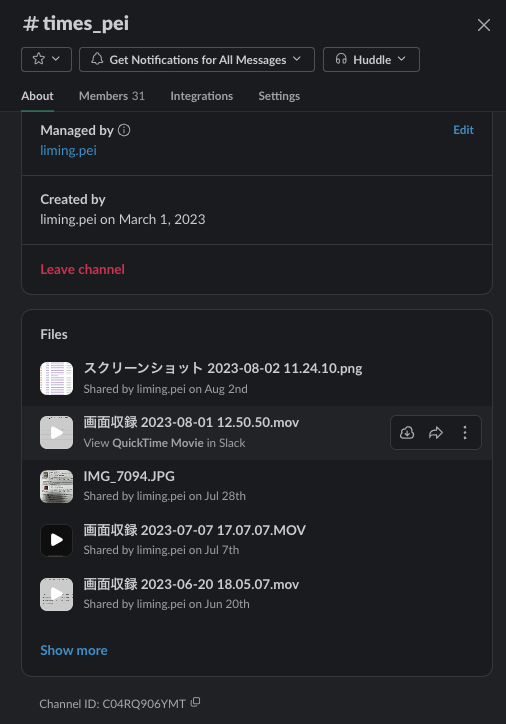
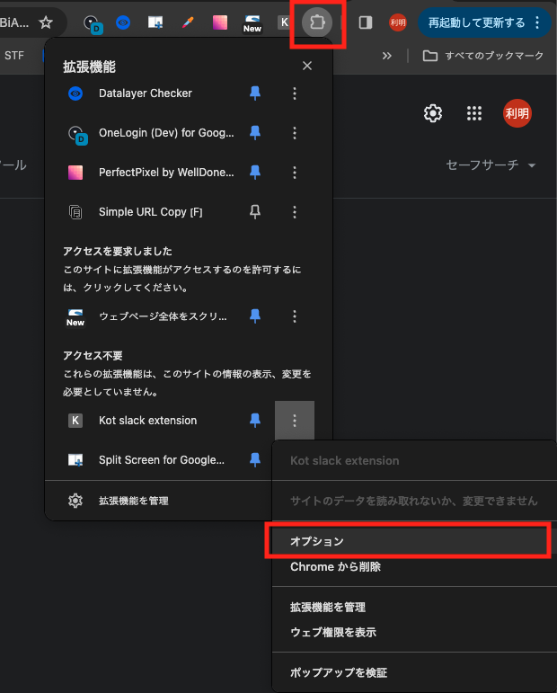
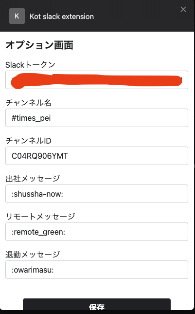
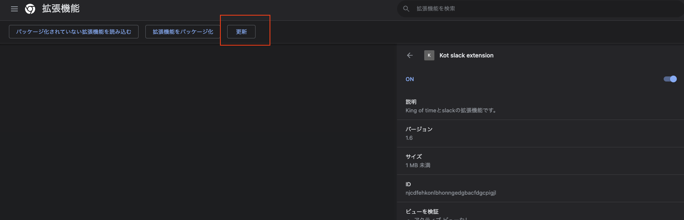
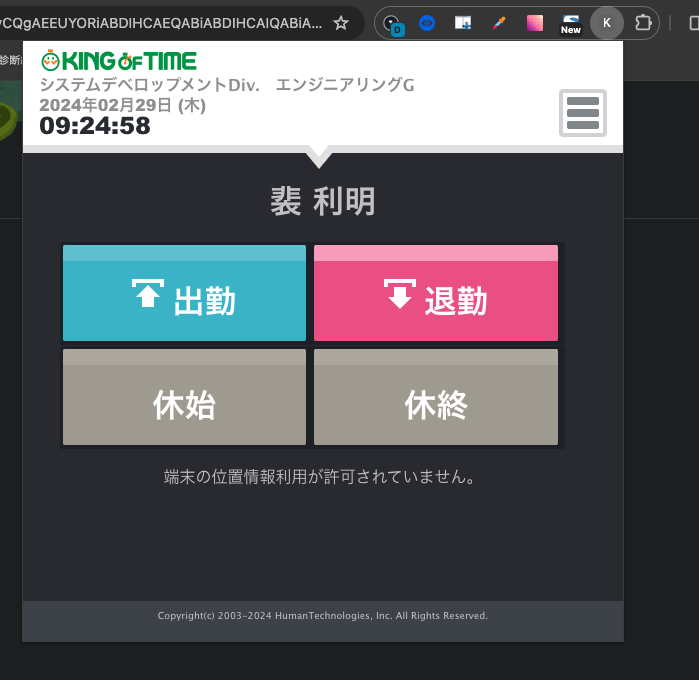

# Kot-notice-App

目標：
・King of timeで出勤 / 退勤 ボタンを押すタイミングで個人のtimes_***チャンネルに「出勤する / 退勤する」メッセージを投稿することで、ワンクリックで出勤するようにします。


Kot-slack-extensionファイルをchromeにデプロイし、
打刻システム「https://s3.kingtime.jp/independent/recorder2/personal/」にchrome extensionアプリとして稼働させます。

### chrome extensionインストール手順：
#### 1. Slack側Bot Token情報などを取得
・Gitからソースの取得
```git clone https://github.com/webcrew-jp/Kot-slack-extension.git```

・ビルド
```
npm run prd

# windowsの場合
copy src/manifest.json dist/manifest.json

# macの場合
cp src/manifest.json dist/manifest.json
```

#### 2. Slack側Bot Token情報などを取得
・ Slack api Management画面に接続
https://api.slack.com/apps/A04SFUN2N3V
・ 「Install App」のReinstall to WorkspaceでBotをSlackにインストール


・ 取得したUser OAuth Token をCopyしメモなどに保存
・ 個人チャンネル#times_xxxでChannel IDをCOPYしておいてメモに保存

#### 2. Chromeブラウザにchrome extensionをインストール
・ Chromeの拡張機能ボタンを開いて、拡張機能を管理を選択。



・ 「パッケージ化されていない拡張機能を読み込む」ボタンをクリックし、distフォルダーを選択。



#### 3. Chromeのchrome extension側でToken情報などを保存
・ KOTのオプション画面を開いて、保存しておいた情報をそれぞれ貼り付けて



・ 出社メッセージ、リモートメッセージ、退勤メッセージを入力して保存


・ 設定が終わったら拡張機能管理画面で更新ボタンをクリック


・ 更新が終わったら、chrome extensionのiconから打刻できるようになった
